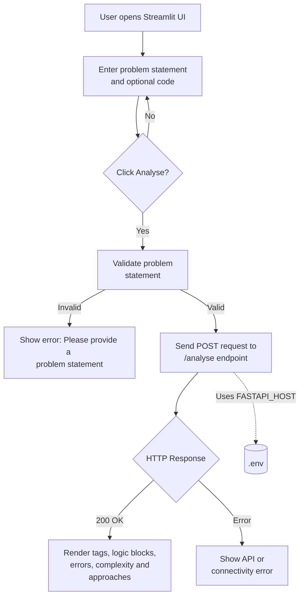
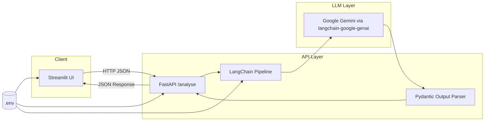
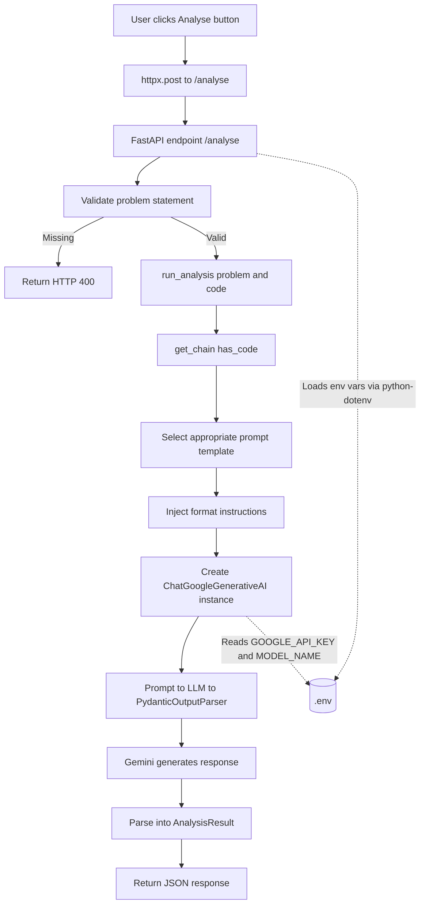

# DSA Analyser Flowcharts

This document captures three views of the application workflow.

## 1) User Interaction Workflow

This shows the end-user path from input to rendered analysis results.

## 2) High-Level System Design

This highlights the main components and the request/response flow across the system.

## 3) Low-Level Services Usage Design

This details the internal service steps inside the API and analysis pipeline.

